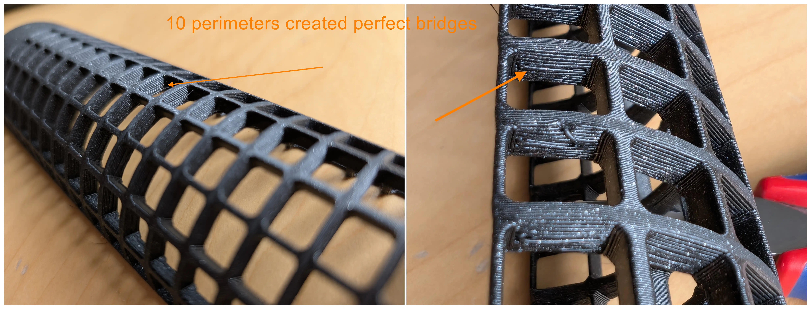
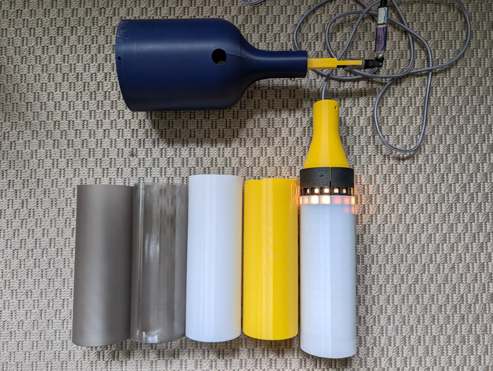

# Fusion Pixelstab

A festival totem highly inspired by Fusion Zauberstab by buddhabrot & tom: [Source](https://git.binary-kitchen.de/buddhabrot/fusion-zauberstab). A excellent (german) write up is available here: [Make Article](https://git.binary-kitchen.de/buddhabrot/fusion-zauberstab/src/branch/master/make_artikel/gesamt.md)

## Repository

Containing

* 3D files for 3D printing
* A guide to configure and assembly
* No software as its just WLED config or (in case for the meshtastic addon, respective configuration)

## Features

* 2,40m tall -> easily visible
* 256 LEDs -> bright
* easy to carry
* huge choice of LED pattern
* no programming or soldering required
* using standard components, no custom PCBs

Here is a short video in action:

[first_night_test.webm](https://github.com/user-attachments/assets/08eeb2bc-af02-406a-8e4e-26b63fb9f7b4)

## Concept

I have also built the totem mentioned above ("Zauberstab"). Its a very high quality totem with a ton of features, extremely nice looking und unique.
 I wanted to build something more accessible, something which needs less soldering (no soldering at all), does not need a laser cutter and in general: its my own design.
 I am using standard parts from shops like AliExpress, standard open source software like WLED and of course, my 3D printer.
The design supports addon-ons, like a meshtastic node that sends the location of the totem to my peers.

## Bill of material

* A 16x16 RBG LED Matrix. I use a 12V version, but also a 5V should be fine. Data protocol is supported by WLED
* WLED compatible LED driver: ["WLED PD Energy Meter ESP32 Sounds Reactive Addressable LED Strip Controller"](https://www.athom.tech/blank-1/wled-pd-energy-meter-esp32-sounds-reactive-addressable-led-strip-controller])
    * Microphone built in and supported by WLED
    * Power input: 12V via USB-C power delivery
* Power: Powerbank with USB-C output, in particular one which supports 12V, in particular "Anker Powerbank 20.000mAh" Model A1689
    * fairly cheap
    * delivers 12V via USB-C
    * can be charged through a different port
    * mounted as "foot" of the rod to balance weight
* Power is routed trough the aluminum rod via 2m USB-C cable. Connected with a magnetic usb-c to usb-c coupler, as the connection is not accessible and inside the rod.
    * usb-c female to female adapter
    * VAFOTON / Model VAF-H006 magnetic coupler (with power delivery support)
    * generic usb-c cable (with power delivery), 2m. Longer or shorter cable will not fit into the rod
* Aluminum rod, 20mm (outside), 17mm (inside), 2m long from a local hardware store ("Bauhaus")
* Some standard 3mm screws and heatset inserts
    * 2 long 35mm screws
    * some shorter screws from a set of screws
* 3D printed body
    * 500g Filament
    * color of your choice but I recommend white for the diffusor for starters
* pig tail 4pin LED Matrix connector
    * if no at hand, you could desolder the output one from the matrix and use it at the input side
   

As the diffusor is somewhat water tight, it even works under water. Don't try this at a festival without a backup unit

## Software

[WLED](https://kno.wled.ge). Since 0.15+ its audio reactive. That means, it has built in 2D pattern, built in sound (claps) and music (bpm) aware animations. Needs to be flashed on the ESP via webflasher. After flashing
* configure the microphones GPIOs
  

* configure the LED matrix
  

* configure a startup pattern of your liking, so you do not need to manually select a pattern after each reboot
* optional: flash WLED with usermods for the built in current sensor. I did this, measured the current once (it was the same as with the external USB-multimeter) and left it deactivated as I do not need online power monitoring
  

Time for a first test

[first_look_50percent.webm](https://github.com/user-attachments/assets/14035ada-8678-426e-b955-b69719d0cac9)

## Electricity

I choose 12V power delivery, because its available in many power banks. A 5V panel needs more amps than most power banks can deliver, but with 12V the current consumption is low enough, so the power banks does not shut down if a bright pattern is shown. Also cables can be thinner and no need to feed the matrix from both sides, although its easily done using the existing connectors

## Shape

I rolled the 256 pixel-panel to a tube. Take care to roll in a way the single stripes are not bent. Then I designed the whole assembly around the circumference

## Design

Fusion 360 was used. Its free for makers and its easy enough to handle. I love the slicer integration. You can send a model directly to your prusa slicer, print, optimize and repeat

Play around with the pixel pattern. Squiggly pixels? Brick layer pixels? Just draw one pixel, multiply it by 16x16 on a sketch and emboss it to a cylinder.

## 3D printing

A lot of experiments have been done
* Differnet pixel shapes
* 

* Slicing tricks: Enable 10+ perimeters, so the bridging algorithm is tricked into using circular bridges
* 

* Different sleeved as diffusior from different materials
* 

    * PLA, white: color neutral
    * 
    * [first_static_fire.webm](https://github.com/user-attachments/assets/1b86edbb-ebab-416d-8447-a735b7279c38)
    
    * PLA, yellow: nice warm effect and good looking at daylight
    * PVB, smoke grey: "darker" look at day, cool pattern at night. No need to go the extra mile and make it transparent with iso propanol. Negative payoff as diffusion is desired to mask the pixels
    
* for the pixel pattern cylinder: use a dark color. Using white bleeds too much light to the next pixel

## Assembly

I suggest to begin with the top electronics. Connect the matrix to your ESP. Roll it up. Stick it into the cylinder

In the beginning its useful to have a split cylinder as you need to access the inners more often. Later on a full cylinder can be used, but needs to be cut if you ever want to get the panel out again.

For the foot, its quite straight forward

Note: I am using a magnetic connector and the female-female usb-c connector from the bill of material to have an easily swappable foot. So you can quickly recharge the totem in 10 seconds. Currently one screw holds the foot, this can be improved with a different clamping mechanism.

## Shakedown run

Try the totem before going to a festival.
Experiences from Zauberstab:
* Microphone's gain needs to be adjusted to excessive volume. Have your smartphone with you at the first test at stage to change settings
* Hammer it a few times onto concrete to check nothing comes loose
  
[first_stomp.webm](https://github.com/user-attachments/assets/597eaff7-7861-46d7-b57b-04249846276d)

* Let the totem fall straight down on the concrete. It will break the sleeve. so print a couple of extras
* Test for rain tightness, I even dipped it into water

[water_test.webm](https://github.com/user-attachments/assets/b024f466-a88c-4878-802c-13ecfd0e517c)

* adjust pixel brightness, at night you do not need full brightness, it also drains your battery quickly

## next steps

* add a relay or switch to be able to shut down the totem if its not in use. currently you need to manually remove the battery for that

## Addons

### Meshtastic. 
I added a module to send the gps coordinates to other [meshtastic](https://meshtastic.org) devices.
Meshtastic is an open source peer to peer network, that enables text communication off  the grid over several km with minimal current draw. It can also transmit your gps position. Ideal to not get lost to your peers in a remote location.
This is totally optional. The module is self contained and sits on top. Can be removed without any screws. The display is visible from the outside so you can also read messages on the pole or see the notification light if its time to check the meshtastic app. In theory the aluminum rod could be replaced with something which could hold a very long antenna, to boost the signal further. The 3db antenna should already give you some km of range, which could be not enough for a large camp site

#### Bill of material

* [Mesh Node T114](https://heltec.org/project/mesh-node-t114/) with GPS, see also [Meshtastic](https://meshtastic.org/docs/hardware/devices/heltec-automation/mesh-node/)
* An old smartphone battery
* A +3db external antenna

The addon module can be removed at any time. Currently it does not draw power from the main power bank as at the head of the  pole I have only 12V available (to be exact, the ESP could deliver some few mA at 3.3V at its digital outputs...)

